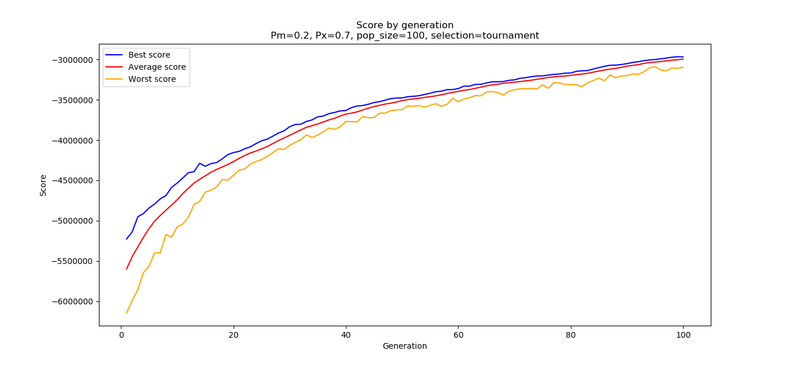
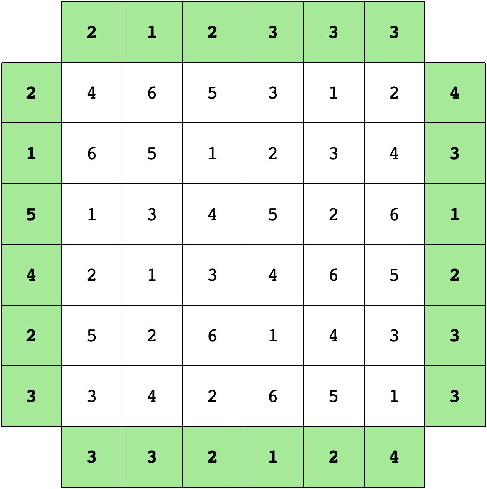
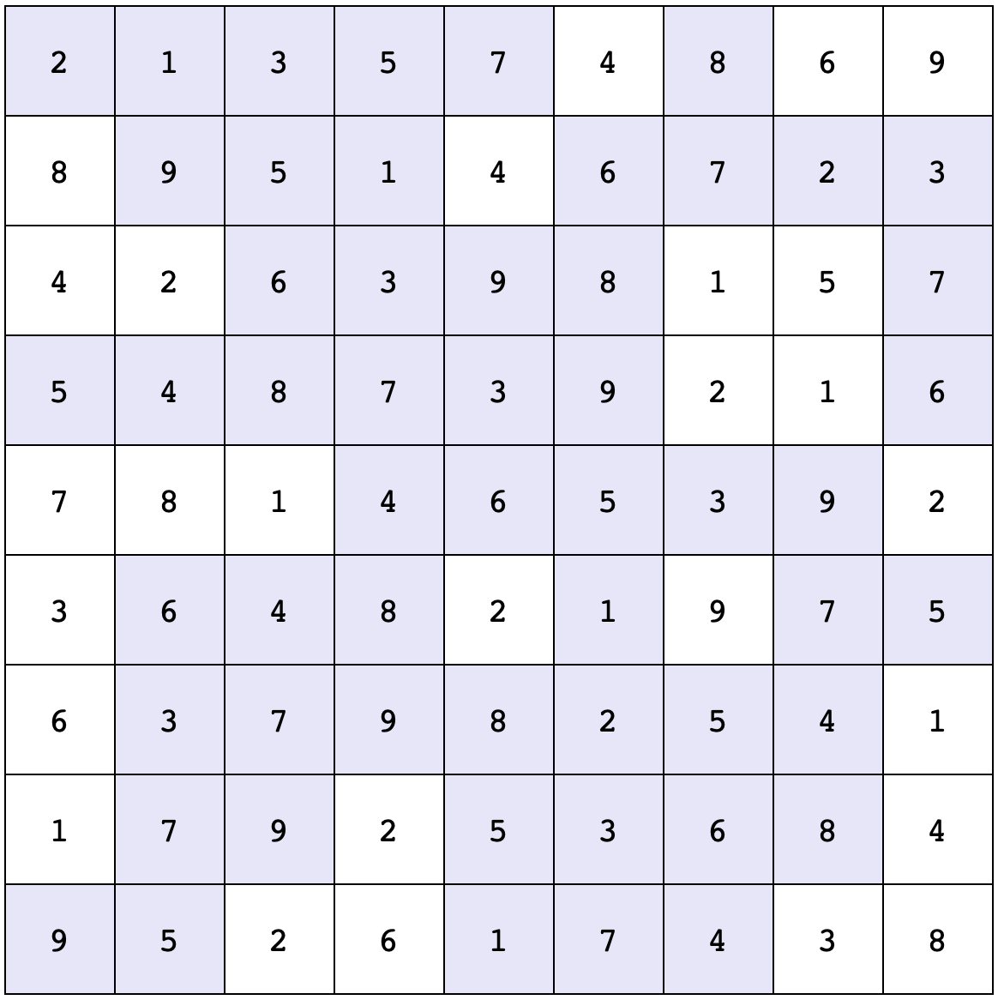
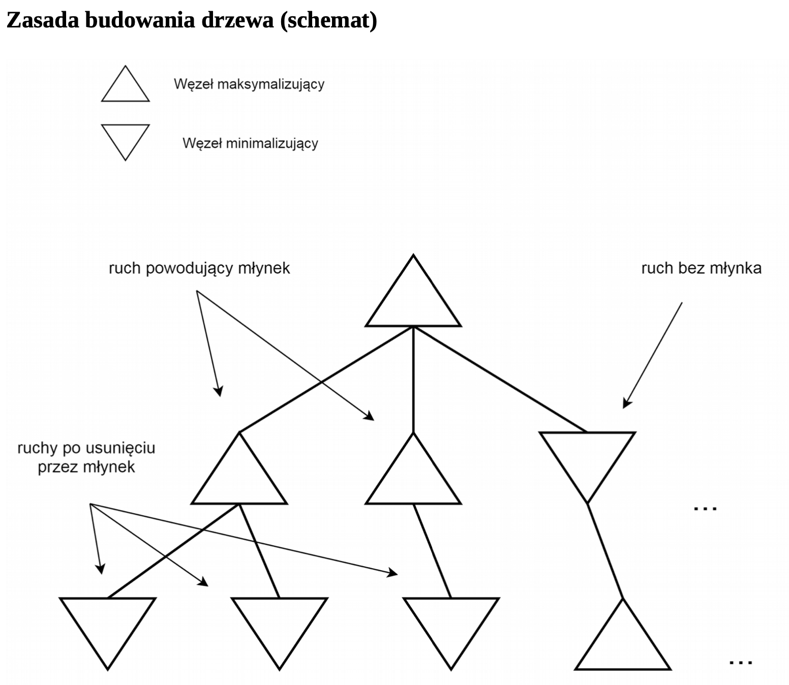
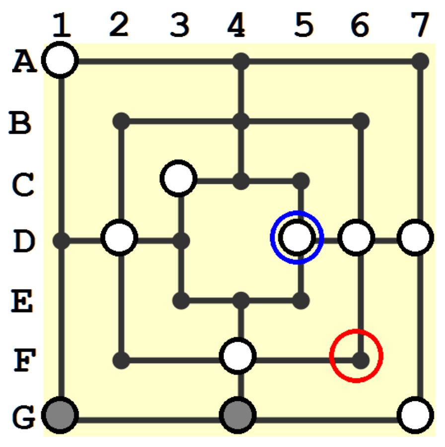
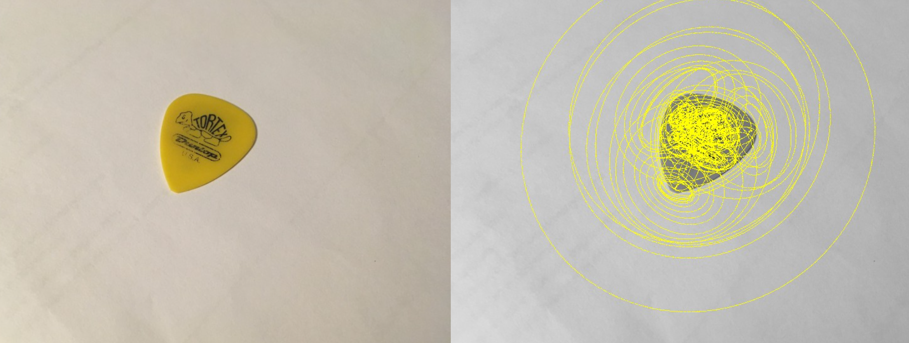
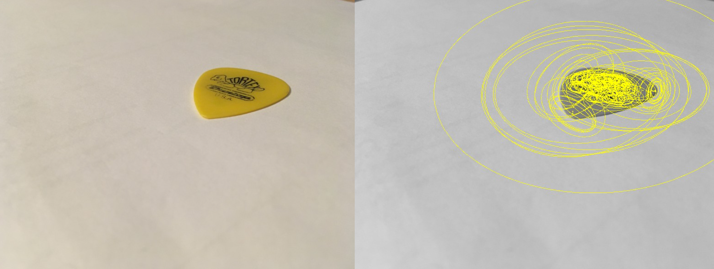
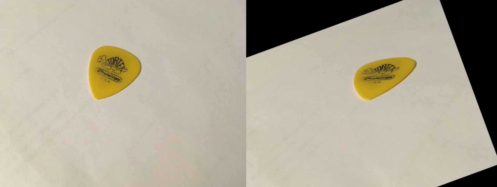
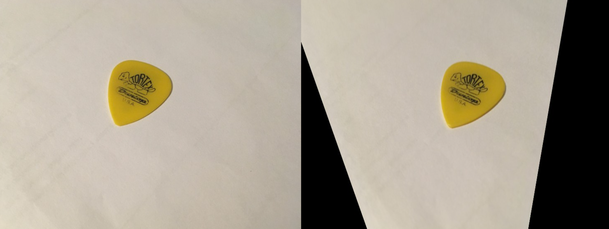

# Artificial-Intelligence-WUST
My public code was written during the course of Artificial Intelligence and Knowledge Engineering at 
Wrocław University of Science and Technology.  
Keep in mind that these tasks were done in a very short time. ***I'm fully aware of not respecting 
code style guidelines.*** Nevertheless this repository should mostly show my knowledge regarding 
Artificial Intelligence and Knowledge Engineering.

##  Task 1 - Travelling Thief Problem
First task consisted of implementing **genetic algorithms** trying to find most-close-to-optimal 
solution to Travelling Thief Problem.  
This problem is the merge of **two NP-Hard problems: Travelling Salesman Problem and Knapsack Problem**.  

Score by generation with given input:

## Task 2 - Constraint Satisfaction Problem
The second task required to implement algorithms solving Constraint Satisfaction Problem with
**backtracking** and **forward-checking**.
In order to determine which field should be taken care of next, these heuristics were used:  
- most constraints - most constrained field by other fields
- smallest domain - take the field with the least possibilities
- first - take the first what's in the memory, don't compute next choice
- domain1 - personal proposal being hybrid with 'smallest domain' and 'first'

Solved skyscrapper_6_4:  
  

Solved futoshiki_9_0:  

## Task 3 - Nine Men's Morris
Third task was about solving zero-sum game with **Mini-Max** algorithm or **Alpha-Beta pruning**.
After heuristics had been proposed for solving Nine Men's Morris, two AIs were fighting each 
with usage of the assigned algorithm.
These heuristics were proposed:
- difference of taken pieces - make moves so you have more pawns than enemy
- freedom of movement - make moves so you have as many possible moves to make
- freedom for deployment - in deployment phase use 'freedom of movement' heuristic, when all pawns are deployed, use 'difference of taken pieces'

The game tree is not standard. It's maximizing and minimizing nodes are dependent on the move. 
After making a move causing mill, another maximizing node is used. This can be seen below.

Rules for building a game tree (Polish):

  

Board at the end of the game between two AIs using Alpha-Beta pruning, freedom of movement heuristic 
and tree depth of 3:

## Task 4 - Similarity in images
Final task required to find similarity in images by using external software finding key points in images 
and **k-nearest neighbours algorithm**. After that, images were transformed by using **affine transformation and 
perspective transformation**.

Key points:

  
  
Affine transformation after 1000 iterations:

  
Perspective transformation after 1000 iterations:

